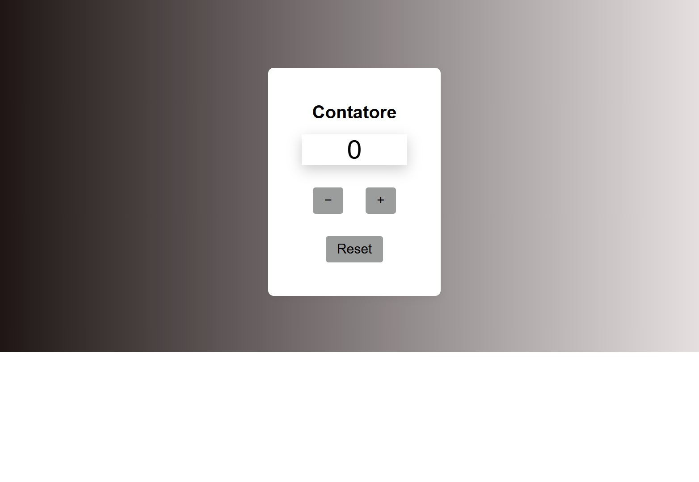

# Contatore JavaScript Puro

## Descrizione

Questo progetto è una semplice applicazione web che simula un contatore.  
Permette all’utente di aumentare o diminuire il valore tramite due pulsanti `+` e `−`, e di resettarlo con un pulsante dedicato.  
L’interfaccia è creata dinamicamente usando JavaScript puro, senza framework o librerie esterne.

---

## Funzionalità

- Valore iniziale impostato a 0
- Pulsante `+` per incrementare il contatore
- Pulsante `−` per decrementare il contatore
- Pulsante `Reset` per riportare il valore a zero
- Interfaccia creata dinamicamente tramite manipolazione del DOM

---

## Come usare

1. Clona o scarica il repository
2. Apri il file `index.html` nel tuo browser preferito
3. Usa i pulsanti per incrementare, decrementare o resettare il contatore

---

## Tecnologie utilizzate

- HTML5 (struttura minima)
- CSS3 per stile e layout
- JavaScript puro per logica e creazione dinamica degli elementi

---

## Screenshot

---

## Prova l'applicazione online

[Prova il contatore su Netlify] https://contatore-js.netlify.app/

---

Realizzato da Marialorenza Gamiddo
